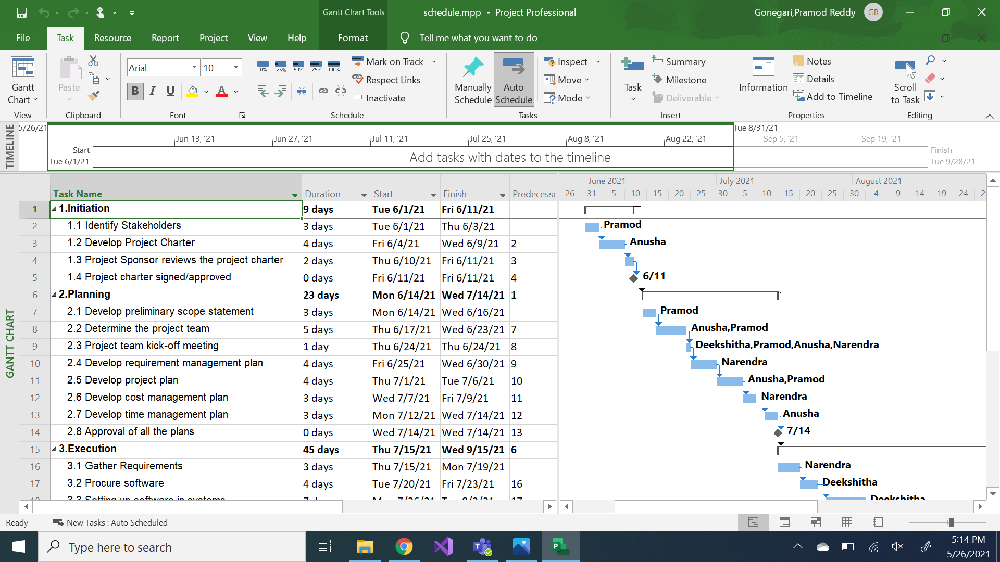
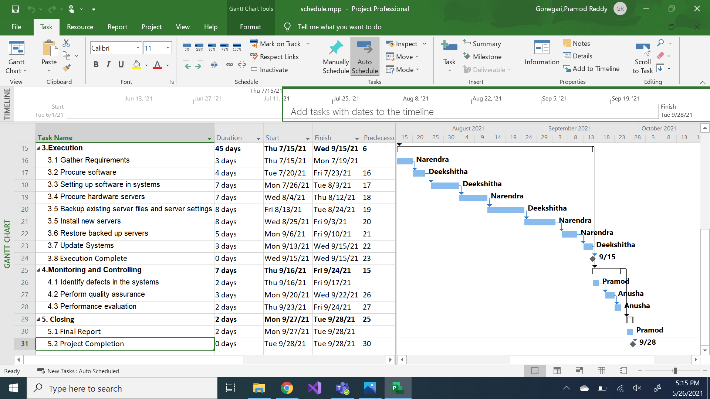
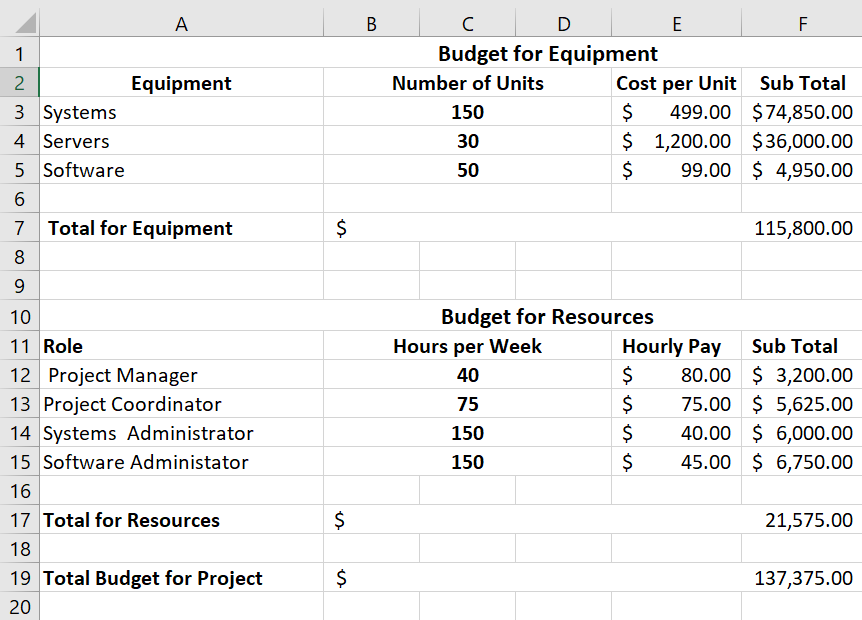

### Table of contents
* Our Project
* Our Team
* Project Charter
* Scope
* Schedule
* Budget

### Our Project
**Company Name:** Techie Geeks

**Project Title:** Project Management to Upgrade IT Equipment
* Project to plan, procure and set up the associated physical requirements, Software and Hardware equipment for an IT Company. Our objective is to upgrade the equipment of an IT company as suitable to the product development environment of the Company.

### Our Team

* [Pramod Reddy Gonegari](https://github.com/pramod096)

* [Anusha Kanagala](https://github.com/Anushakanagala)

* [Narendra Kumar Gunturu](https://github.com/Narendra-kumar-Gunturu)

* [Deekshitha Bichinaepally](https://github.com/deekshitha22)

### Project Charter
* [Click to view our Project Charter](charter/charter.md)

### Scope
#### Work Breakdown Structure

#### 1. Intiating
 * 1.1 Identify Stakeholders
 * 1.2 Develop Project Charter
 * 1.3 Project Sponsor reviews the project charter 
 * 1.4 Project charter signed/approved
 * 1.5 Evaluations and recommendations
 
#### 2. Planning 
 * 2.1 Develop preliminary scope statement 
 * 2.2 Determine the project team 
 * 2.3 Project team kick-off meeting
 * 2.4 Develop requirement management plan
 * 2.5 Develop project plan  
 * 2.6 Develop cost management plan 
 * 2.7 Develop time management plan  
 * 2.8 Approval of all the plans
 
#### 3. Execution
  * 3.1 Gather Requirements
  * 3.2 Procure software 
  * 3.3 Setting up software in systems
  * 3.4 Procure hardware servers
  * 3.5 Backup existing server files and server settings
  * 3.5 Install new servers
  * 3.6 Restore backed up servers
  * 3.7 Update Systems
  
#### 4. Monitoring and Controlling
  * 4.1 Identify defects in the systems
  * 4.2 Perform quality assurance
  * 4.3 Prepare performance evaluation
  
#### 5. Closing
  * 5.1 Reviews & Feedback
  * 5.2 Project Completion

### Schedule
* Start Date
  * 06/01/2021
* End Date
  * 09/28/2021
* Duration
  * 4 months

* [View our Schedule](schedule/schedule.mpp)

### Budget

* The Comapany has allocated $150,000 for this project. Most of the cost for this project will be for hardware equipment.

* [Here is our Detailed Budget](budget/budget.xlsx)
